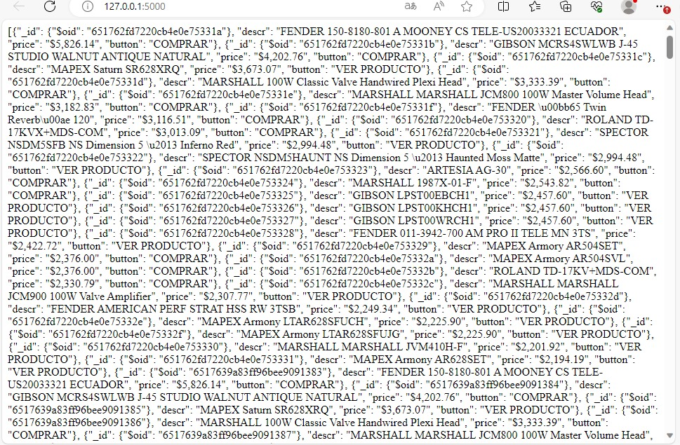

# prueba2
Para la parte 2 se tomó los datos obtenidos en la parte 1 y se creó un servicio web (usando Python + Flask) 
que va a acceder a esa base de datos y se creo la aplicación donde va a salir un print de los datos

